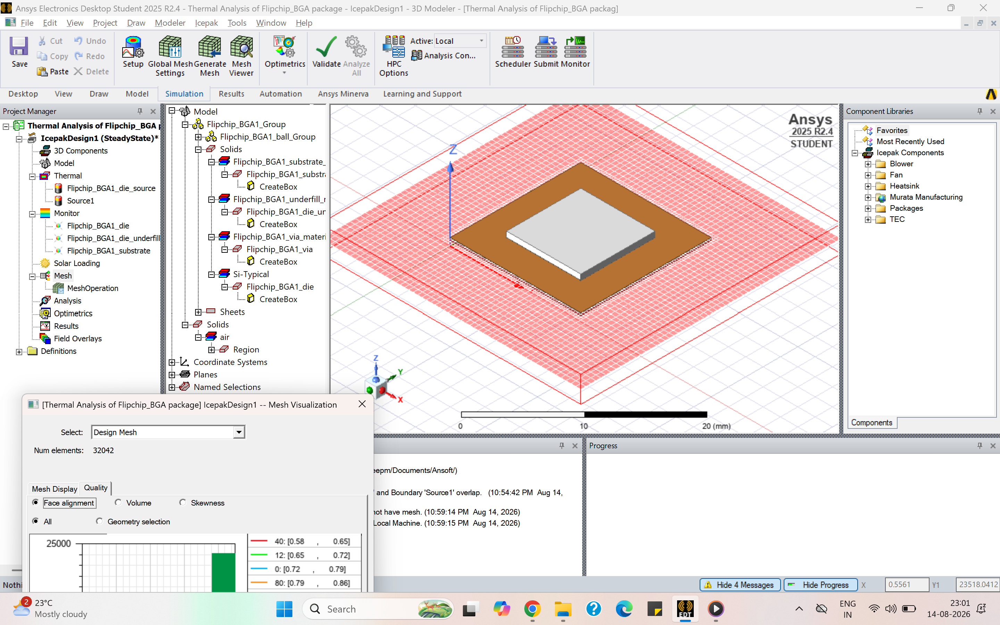

# Advanced Semiconductor Packaging & Thermal/Electrical Analysis

This repository documents the coursework, technical concepts, and hands-on simulation labs completed as part of the **Advanced Semiconductor Packaging Certification Course**.

It includes theoretical insights into packaging selection, cleanroom assembly flows, and testing methodologies, alongside multi-physics simulations performed using **ANSYS Electronics Desktop (AEDT) Student Edition**.

---

## Table of Contents
- [Course Overview & Theoretical Foundations](#course-overview--theoretical-foundations)
- [Lab 1: Thermal Analysis of Flip-Chip BGA Package](#lab-1-thermal-analysis-of-flip-chip-bGA-package)
- [Lab 2: 3D Package Design Cross-Section & Multi-Physics Analysis](#lab-2-3d-package-design-cross-section--multi-physics-analysis)
- [Tools Used](#tools-used)

---

## Course Overview & Theoretical Foundations

### 1. Semiconductor Ecosystem & Packaging Fundamentals
* **Industry Ecosystem:** Interaction between Fabless Design Houses, Foundries, and OSAT (Outsourced Semiconductor Assembly and Test) vendors.
* **Selection Criteria:** Trade-off analysis based on application constraints, pin/pad count, thermal dissipation needs, overall cost, long-term reliability, and target form factor.
* **Mounting Technologies:** Comparative evaluation of Through-Hole Mounting (THM) vs. Surface Mount Technology (SMT).

### 2. Assembly & Cleanroom Processing
* **Wire Bonding:** Gold (Au) wire connection methods for die-to-substrate interconnections.
* **Flip-Chip & Wafer-Level Packaging (WLP):** Solder bump array implementation and Redistribution Layer (RDL) fabrication techniques for high-density interconnections.

### 3. Package Testing Methodologies
* **AOST (Assembly Open and Short Test):** Continuity verification prior to full power-up.
* **Burn-in Testing:** High thermal and voltage stress testing to accelerate early-life failures (Infant Mortality).
* **Final Test (FT):** Complete parametric, functional, and reliability characterization across operating temperature corners.

---

## Lab 1: Thermal Analysis of Flip-Chip BGA Package

### Objective
Perform thermal simulation and mesh quality verification on an imported Flip-Chip Ball Grid Array (FC-BGA) package model to evaluate thermal dissipation performance under operating power loads.

### Package Parameters & Setup
* **Package Geometry & Die:** Import of standard FC-BGA model, die geometry configuration, and total die power dissipation setup.
* **Substrate & Vias:** Multi-layer substrate stack-up setup with thermal vias for heat conduction paths.
* **Solder Ball Array:** Ball pitch, height, diameter configuration, and array grid assignment.
* **Heat Sink Integration:** Optional passive/active cooling attached to the package lid.

### Workflow & Results
1. **Model Import & Material Assignment:** Configured thermal conductivity properties for die, substrate layers, thermal vias, and solder bumps.
2. **Meshing Strategy:** Generated fine adaptive mesh around high thermal gradient zones (die-bump interface). Verified mesh metrics for solution convergence.
3. **Design Validation & Solve:** Executed thermal solver in ANSYS Electronics Desktop.

> **Visual Results:**
> 
>
> 
> *Figure 1.1: Generated mesh visualization*
>
> 
> *Figure 1.2: Temperature analysis across FC-BGA assembly.*

---

## Lab 2: 3D Package Design Cross-Section & Multi-Physics Analysis

### Objective
Construct a 3D package cross-section from first principles using **ANSYS Q3D Extractor / AEDT** and execute electrical and thermal simulations.

### Stack-up Specifications & Dimensions

| Layer / Component | Dimensions ($L \times W \times T$) | Material | Purpose / Notes |
| :--- | :--- | :--- | :--- |
| **Die** | $3.0 \text{ mm} \times 3.0 \text{ mm} \times 0.2 \text{ mm}$ ($200\space\mu\text{m}$) | Silicon ($\text{Si}$) | Active silicon die centered at origin |
| **Substrate** | $5.0 \text{ mm} \times 5.0 \text{ mm} \times 0.5 \text{ mm}$ thickness | `FR4_epoxy` | Core carrier PCB |
| **Die Attach** | Scaled die interface | `modified_epoxy` | Die-to-substrate mechanical adhesive |
| **Wire Bonding** | Standard bond wires | Gold (`Au`) | Connects die bond pads to substrate bond pads |
| **Mold Compound** | Encapsulation $\times 1.2 \text{ mm}$ thickness | `epoxy_kelvar_XY` | Full package encapsulation |

> **Design Consideration:** Total un-encapsulated height was $\approx 0.7 \text{ mm}$ ($\text{Substrate} = 0.5 \text{ mm} + \text{Die} = 0.2 \text{ mm}$). A molding height of $1.2 \text{ mm}$ was specified to maintain sufficient vertical headroom, protecting the underlying die and wire bonds from stress during laser marking operations.

### Multi-Physics Analysis
Following geometric construction, thermal and parasitic electrical extraction (RLGC) simulations were conducted on the wire-bonded interconnects.

> **Visual Results:**
> *(Upload your screenshots to `lab2-package-design/screenshots/` and update paths below)*
>
> 
> *Figure 2.1: 3D package cross-section showing die, die-attach, substrate, and gold bond wires.*
>
> 
> *Figure 2.2: Package encapsulation showing headroom clearance for laser marking.*

---

## Tools Used
* **ANSYS Electronics Desktop (AEDT) Student Edition**
  * ANSYS Thermal Solver (Icepak/Thermal)
  * ANSYS Q3D Extractor
